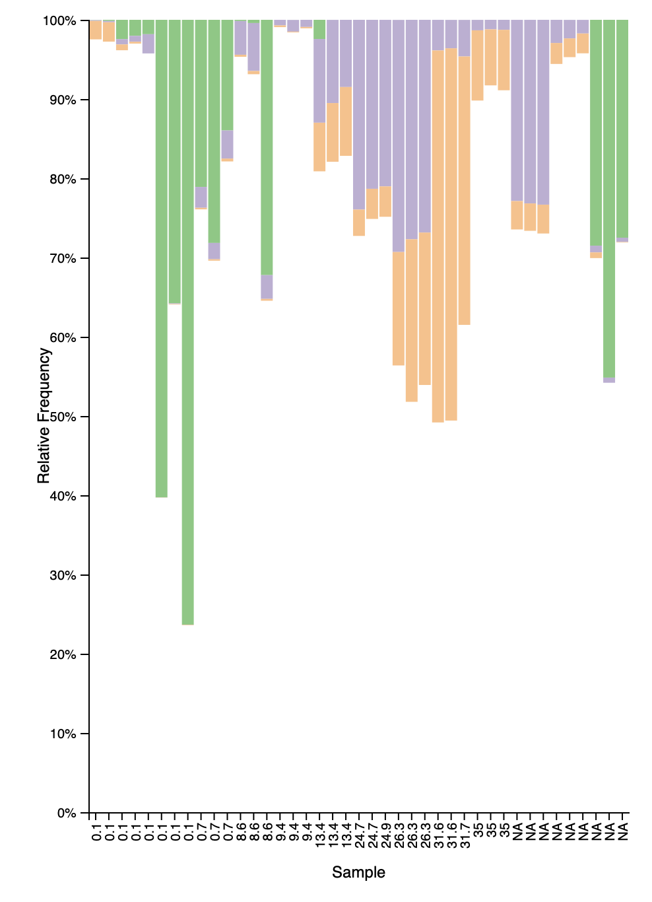

# Metabarcoding to Compare Fish Species Across Apalachicola Bay, Hawaii, and Great Bay

## Author

Rachael Shea

## Background

I was interested in the metabarcoding data collected by the National Estuarine Research Reserve (https://www.estuarydna.org) to gain insight into eukaryotic biodiversity in the US, specifically Apalachicola Bay in Florida, Hawaii, and Great Bay in New Hampshire. In these diverse ecosystems where fish and shellfish are frequently sourced, taking a look at the taxonomic composition can provide a better understanding of the health of these estuaries, including microorganism or invasive species presence.  

## Methods

* The sequences from NERRS were downloaded in fastqz format. 
* On the Ron computing cluster, a conda environment was loaded to run programs including a polyFilter, cutadapt trim with 18s primers, demux summary, denoise, and a classification using a machine learning classifier. A taxa barplo6t, phylogenetic tree, and alpha and beta diversity metrics were generated from the classified data. 
* Analysis was run on a Macbook Air laptop 

## Findings

Figure 1. Barplot showing taxonomic distribution in Apalachicola Bay, Hawaii, and Great Bay corresponding to different salinity values. Enterobacteriaceae are depicted by green bars and are most numerous at 0.1-0.7 salinity, with a relative frequency of up to 76.33%. Bacillariophyceae and Dinophyceae, depicted by purple and orange bars respectively, were most frequently found at 13.4-35 salinity. 

Figure 2.